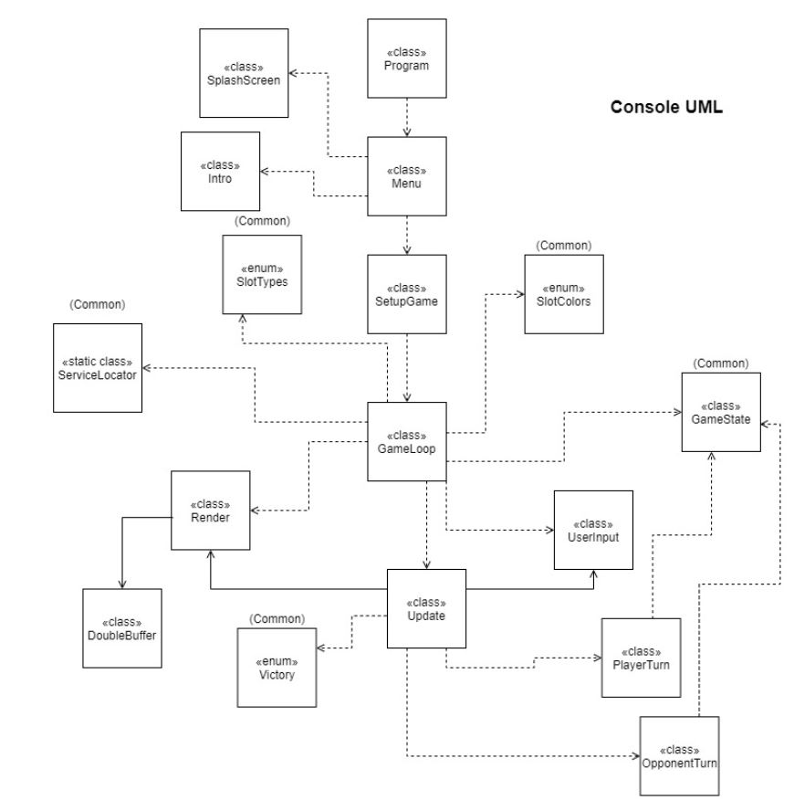

# Projeto 3

 **Francisco Pires a21804873:**
 - Planeamento, estruturação, organização e gestão do projeto.
 - Código comum.
 - Implementação do código comum na Consola.
 - Implementação do código comum no *Unity*.
 - *Polishing* e documentação do código.
 - Correção de *bugs*.
 - Relatório
 
 **Nuno Figueiredo a21705451:**
 
 **André Cosme a21802129:**
 
 **Repositório do projeto**: https://github.com/FRP7/Projeto3LP2
 **Repositório do código comum**: https://github.com/FRP7/Projeto3LP2_Common
 
# Arquitetura da solução
**Descrição breve da solução:**

Esta solução tem como objetivo replicar o jogo marroquino *Felli* para a 
Consola e para o *Unity* com o código da lógica do jogo igual para ambos, 
em *C#*.

**Desafios:**

O código comum foi feito com o objetivo de ser completamente independente da
Consola e do *Unity*, por isso exigiu um nível de abstração significativo, 
pelo que foi bastante difícil de realizar. Na implementação da Consola e do 
*Unity*, também tentámos organizar o código de maneira a que fossem 
semelhantes e por ventura, de fácil compreensão.
Também evitámos ao máximo o uso de variáveis e propriedades *static* de forma a
manter o código profissional e não tanto de *Unity Programmer*.

**Organização:**

A solução foi feita tentando sempre que possível respeitar os princípios
*SOLID* (especialmente o *Single-responsibility principle*), e para isso
utilizámos como *Design Pattern* o *Model-View-Controller* (MVC) para
organização do projeto (com o uso de submódulos no *Git* para facilitar). 
Tentámos sempre que possível evitar o uso de variáveis e propriedades
*static* por isso, utilizámos também o *Service Locator* *pattern* quando 
necessitávamos. 
O primeiro *pattern*, foi utilizado para separarmos o que é comum em ambas as 
implementações e para evitarmos andar a copiar e a colar código frequentemente
(por isso o uso de submódulos), o segundo *pattern* foi utilizado para replicar
o *GetComponent* do *Unity* e para evitarmos o uso de variáveis e propriedades
*static*. 
Na Consola, utilizámos o *GameLoop pattern* e o *Update pattern* (com forte 
inspiração na arquitetura do *Unity*) para assim mantermos o projeto organizado
e fácil de entender.  O *Component pattern* não foi utilizado porque sentimos
que o jogo era demasiado simples para exigir isso, respeitando assim o 
princípio *KISS* (*Keep it Simple, Stupid*) e *YAGNI* (*You Ain't Gonna Need
It*).
No *Unity* não utilizámos nenhum *pattern* visto já ter o *GameLoop pattern*
na sua arquitetura mas, tentámos sempre que possível respeitar os princípios
*SOLID* na mesma. 

**Lógica:**

No código comum, é listado numa coleção (neste caso, uma lista) todas as casas
do tabuleiro (sejam vazias ou ocupadas pelo jogador ou oponente). Essa lista
indica exatamente o que contêm cada espaço (vazio ou ocupado pelo jogador ou
pelo oponente) e a sua respetiva cor (branco, preto ou cinzento) através de 
*enums*. Em todos os turnos, essa mesma lista é atualizada para assim guardar
o estado lógico atual do tabuleiro. Além desta lista, também tem uma lista de
jogadas legais possíveis que é atualizado sempre que o jogador ou o oponente 
desejam jogar, e após jogar, essa lista é esvaziada e a lista do estado do jogo
é atualizada.
No código da Consola e do *Unity*, detetam o input do jogador, chamam os
respetivos métodos do código comum  e depois desenham o resultado no ecrã. 

**Código de terceiros:**

Durante o projeto, evitámos sempre que possível o uso de *static* por isso, nas
situações em que sentimos  necessidade para tal, utilizámos o código do
*Service Locator pattern* disponibilizado pelo professor para assim evitar o 
uso do mesmo.
Na renderização do jogo na consola, para melhorarmos a performance e reduzirmos
o *tearing*, utilizámos o código do *DoubleBuffer* que foi feito num exercício
em contexto de aulas.

**UML do código comum**


**UML da Consola**



**UML do Unity**


## Referências

Para criar os parâmetros que aceitam métodos, baseei-me nesta solução no
*StackOverflow*:
https://stackoverflow.com/questions/1996426/pass-multiple-optional-parameters-to-a-c-sharp-function
```cs
public static int AddUp(params int[] values)
{
    int sum = 0;
    foreach (int value in values)
    {
        sum += value;
    }
    return sum;
}
```
Para criar o *DoubleBuffer*, utilizei este exercício feito numa das aulas:
https://github.com/VideojogosLusofona/lp2_2020_aulas/tree/main/Aula11/Exercicio1

Utilizei também o *Service Locator* feito pelo professor demostrado numa das 
aulas.

Também consultámos os slides das aulas e a documentação *C#* da *Microsoft* e
do *Unity*.